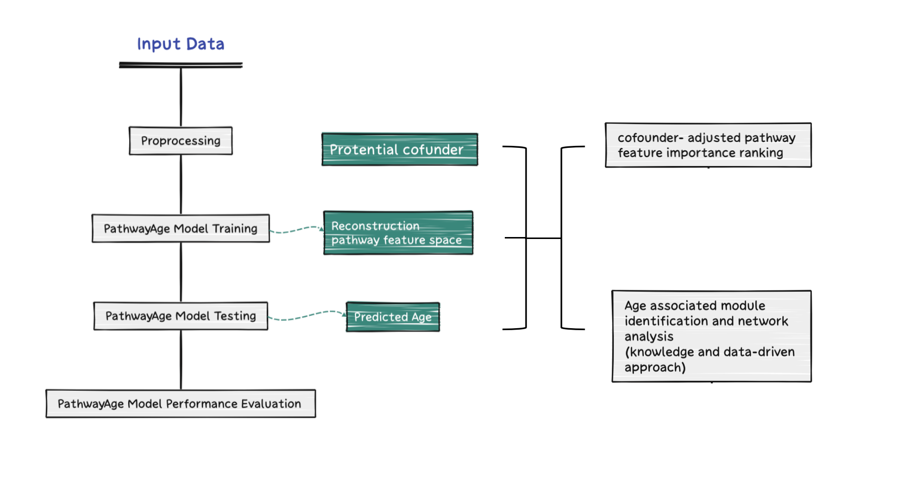
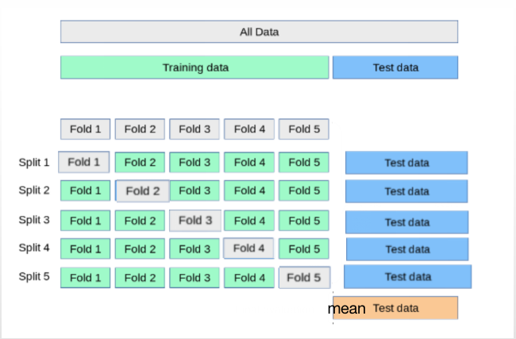

PathwayAge
==============

We present PathwayAge, a biologically-informed, machine learning-based epigenetic clock that integrates pathway-level biological data to predict biological age and assess disease-related risks. 

For business reasons, the core algorithm is currently available on a separate GitHub repository. If you are conducting research and would like access, please feel free to reach out via email pan.Li.1122@proton.me.

 <!--  -->

Repository Structure
------------------- 
- `1-PathwayAge Model/`: This directory contains the code for building and evaluating the PathwayAge model using Methylome and Transcriptome data to predict biological age.
- `2-Aging Associated Pathways and Modules/`: This directory provides instructions for identifying age-associated GO/KEGG pathways, and modules using a clustering approach.
- `3-Disease Risk Association /`: This directory demonstrates that PathwavAge outperforms traditional clocks in predicting biological age acceleration and reveals distinct disease-specific aging patterns in aging-related diseases.
- `4-Disease-Specific pathways/`: This directory contains analyses of disease-specific pathways across various conditions ,including sex-stratified differences within each disease.
- `5-reproducibility in Transcriptomics/`: This directory contains replication analysis of PathwayAge using transcriptomics, along with validation of the reproducibility of the age-associated methylation pathways.

Installation
------------------- 

1. clone the repo:
 
```bash

git clone git@github.com:BioTransAI/pathwayAge.git

```
2. environments:
  - Make sure the  [Anaconda](https://www.anaconda.com/products/individual)  or [Miniconda](https://docs.conda.io/projects/miniconda/en/latest/) is already installed.  <br>
  - Move the file "pyBioTrans.yaml" under the path ~/miniconda3/bin/. <br>

  ```bash
  
    mv pyBioTrans.yml ~/miniconda3/bin/
    cd ~/miniconda3/bin/
    conda env create -f pyBioTrans.yml
    conda activate pyBioTrans

  ```


Example Usage:
------------------- 

 To predict biological age, please call the "PathwayAge" function.

  - Supplying both the training dataset and the testing dataset:

  ```python

    from pathwayAge import pathwayAge
    
    pathwayAge(
      # import Training data
      methylData = methylTrainData,
      # import testing data
      methylTestData = methylTestData,
      # name the file for the prediction results
      resultName = resultName,
      # Select one machine learning method
      predictionMode = predictionMode,
    )
  ```

  - Using only the training dataset, the model will automatically perform nested cross validation to prevent data leakage into the testing data labels (Age) in stage1.

  <!--  -->

  ```python

    from pathwayAge import pathwayAge
    
    pathwayAge(
      # import Training data
      methylData = methylTrainData,
      # name the file for the prediction results
      resultName = resultName,
      # select one machine learning method
      predictionMode = predictionMode,
    )
  ```
